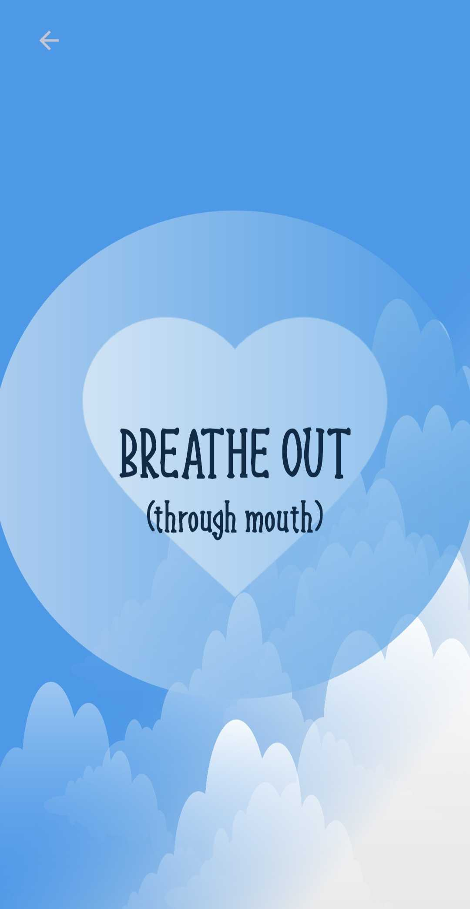
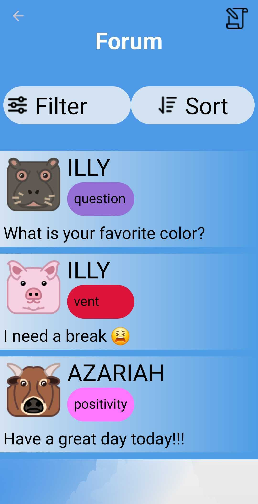
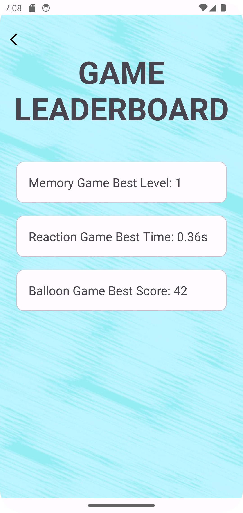

# BreatheEasy

## Why BreatheEasy?
In today's over-demanding and fast-paced world, it is easy to feel overwhelmed and depressed at times. What if you had a way to escape? Welcome to BreatheEasy.\
BreatheEasy's main goal is to help users with their mental health by providing several options for dealing with negative feelings, like anxiety and stress. From engaging mini-games to calming breathing exercises, each feature is designed to empower you towards better mental health. It's the 24/7 immediate support you need the most.

## A Glance Into What BreatheEasy Offers

## Begin Your Journey to Peace of Mind 
How to install BreatheEasy on your Android device:
1. Click the APK file download link below.
2. You’ll receive a warning at the bottom of the phone letting you know that you must give that app permission to install the file. Tap the Settings button to proceed.
3. On the next page, you’ll be asked to allow the app to make APK installs.
4. A prompt should pop up, giving you the option to Install the app. Go ahead and follow the instructions to complete the install.
**Note** — Sometimes, you may need to begin installation again after giving the app permission to download.

**Download Link:** [Download BreatheEasy v0.9](https://github.com/SCCapstone/Garp/releases/download/v0.9/app-debug.apk)

## Sneak Peek!

  
  
  

## Meet the Creators!
**Adrian Luedicke:** LUEDICKA@email.sc.edu \| [Github](https://github.com/ALuedicke)

**Joe Comiskey:** COMISKEJ@email.sc.edu \| [Github](https://github.com/joecomisk11) \| [LinkedIn](https://www.linkedin.com/in/joe-comiskey/)

**Azariah Laulusa:** LAULUSA@email.sc.edu \| [Github](https://github.com/AzariahLaulusa7) \| [LinkedIn](https://www.linkedin.com/in/azariah-laulusa-9458bb260/)

**James MM Thurlow:** JTHURLOW@email.sc.edu \| [Github](https://github.com/james-thurlow) \| [LinkedIn](https://www.linkedin.com/in/jamesthurlow2001/)

**Joseph Brancker:** BRANCKER@email.sc.edu \| [Github](https://github.com/josephbrancker)
