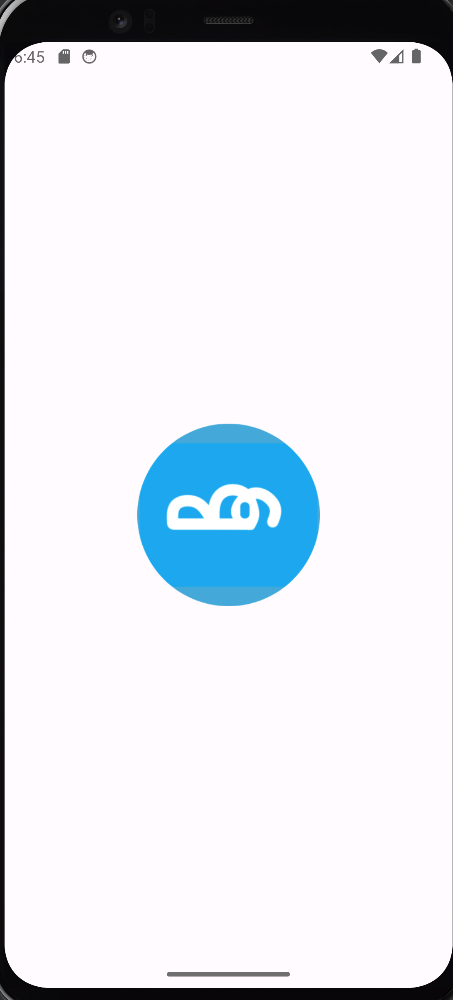

# BreatheEasy

## Why BreatheEasy?
The Meditation app's main goal is to help users with their mental health by providing them with an easy-to-use resource in states of heightened emotion.
It provides several options that target different approaches for dealing with negative feelings like anxiety and panic.

## A glance into what BreatheEasy offers
Video here
)

## Begin your journey to peace of mind 
(Directions to use the app here)

## Sneak peek!

  
  
  

## Authors
**Adrian Luedicke:** <LUEDICKA@email.sc.edu>

**Joe Comiskey:** <COMISKEJ@email.sc.edu>

**Azariah Laulusa:** <LAULUSA@email.sc.edu>

**James MM Thurlow:** <JTHURLOW@email.sc.edu>

**Joseph Brancker:** <BRANCKER@email.sc.edu>
